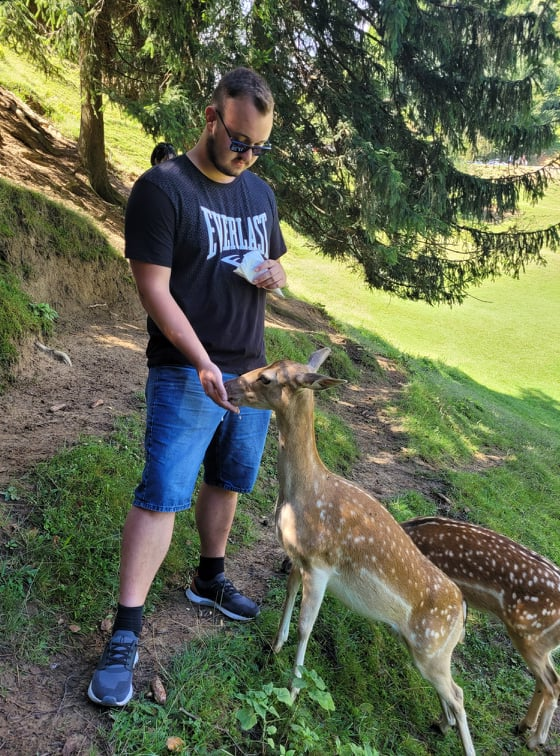

Pozdravljeni,
V tej nalogi sem naredil spletno stran, na kateri lahko izveste več o meni, mojih izkušnjah in ciljih.
Naučil sem se kako uporabljati navigation bar in kako narediti da se skrije/pokaže.

            
                <a href="#" onclick="openSlideMenu()">
                    <i class="fas fa-angle-double-right"></i>
                </a>
            
            

                <a href="#" class="close" onclick= "closeSlideMenu()">
                    <i class="fas fa-angle-double-right"></i>
                </a>
                
                <a href="index.html"> <i class="fas fa-home"></i> Moji podatki</a>
                <a href="about.html"> <i class="fas fa-male"></i> O meni</a>
                <a href="school.html"> <i class="fas fa-graduation-cap"></i> Šola</a>
                <a href="experience.html"> <i class="fas fa-envelope-open-text"></i> Izkušnje</a>
                <a href="goals.html"> <i class="fas fa-bullseye"></i> Cilji</a>
                <a href="https://github.com/matevzbirk"> <i class="fab fa-github"></i> Github </a>
                <a href="https://matevzbirk.github.io/Game-Of-Javascript/index.html"> <i class="fas fa-project-diagram"></i> Projekti </a>
                <a href="https://matevzbirk.github.io/elektroncek/"> <i class="fas fa-shopping-cart"></i> Trgovina </a>
            

        
